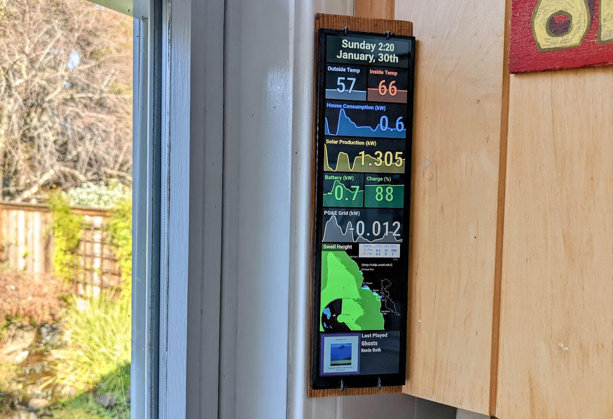

# RPi Home Status Display

This project runs on a Rasberri Pi Zero W to display real-time data including solar production, weather conditions, what song is playing, and ocean conditions.

## Overview

I wanted to create a status display for my parent's house. The weather station in their kitchen was failing and I had discovered these inexpensive 8.8 inch 480x1920 LCD displays that would fit perfectly in the corner of the kitchen window. They had just installed solar so I thought it would be a great way to show their production and battery status too. Added Spotify integration to show what song was playing on their speakers. The map shows bay area ocean conditions. My mom is an avid surfer so being able to  see the swell height and glance was useful too.



## Features

- **Date Display**: Current date and time
- **Weather Monitoring**: Indoor and outdoor temperature data from their Ambient Weather station
- **Solar Power Integration**: Integrates with the Enphase Envoy system to show:
  - Current solar production
  - Home power consumption
  - Battery status
  - Grid power usage/contribution
- **Spotify Integration**: Shows currently playing music with album art
- **Ocean Conditions**: Displays swell height chart from CDIP

## Technical Architecture

### Hardware

- Raspberry Pi Zero W
- 8.8 inch 480x1920 IPS LCD display
- 30W Anker Power Strip
- Custom wood mounting frame

### Backend

- Node.js
- pm2 process manager
- WebSocket server to push updates to the frontend
- Multiple middleware components:
  - `enphase.mjs`: Integrates with local Envoy API
  - `weatherStation.mjs`: Receives weather station data
  - `spotify.mjs`: Integrates with Spotify API
  - `tides.mjs`: Fetches ocean swell data from CDIP
  - `status.mjs`: Maintains system status information

### Frontend

- Vue 3
- Dynamic SVG Area Chart component for displaying historical data

## Setup Instructions
1. Pre-install the frontend:
```
npm install
npm run build
```
2. Copy files to Raspberry Pi Zero W
3. Move dotfiles to home directory.
4. Reboot

## Configuration

The system is designed to work with:
- Enphase solar system (configured to connect to local IP)
- Ambient Weather station
- Spotify account (requires API credentials)

## Future Improvements

- Night mode / button to dim display
- Show daily Solar production when Solar production reaches 0 at end of day.
- Management interface to configure settings

## Notes

This project is specifically designed for a particular home setup and display size. It will require modifications to work with different hardware configurations or data sources.